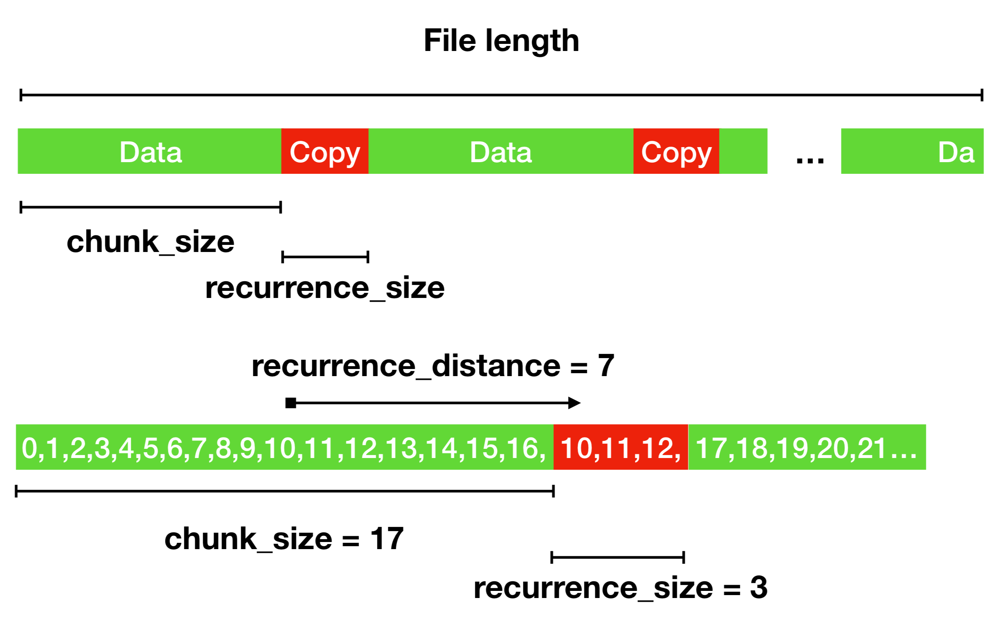

# FixItFelix

This little helper repairs data collected by our project partner with NI Hardware. A bug in the data collection software adds additional values copied from a previous slice at the end of each data chunk before writing it down to disk.

## Installation

You may use Poetry to install all needed packages in a fresh environment or check if you have the needed packages in _pyproject.toml_.

## Theory

We are lucky, because the bug behavior is well understood and follows simple patterns. Additionally, no random values are added, but copies of previous data. So we are able to test if we have found (and deleted) the right values.

You can see an example in the image below:

As you can see, three variables are needed to describe the ongoing:

* chunk_size: Length of a chunk of good data, each written to disk one after another
* recurrence_size: Length of a bad data chunk, copied from a position before
* recurrence_distance: Distance from the bad data to the position they are taken from

## Description of our Data Correction Process

The data is stored in a National Instruments TDMS binary file. This file is then read with [nptdms](https://pypi.org/project/npTDMS/) and converted to numpys [memory maps](https://docs.scipy.org/doc/numpy/reference/generated/numpy.memmap.html), e.g. written to disk and accessable with numpy.

The three variables that describe the error pattern are than used to make a list of index pairs that describe the "good data" chunks. Those chunks are then written to a new, corrected TDMS file.

Because we do not want to rely on correct pattern variables, we employed an error monade to do several tests on the data and check if the recurrences in the data are described correctly. At the moment, you have to find the correct variables on your own. We may build an algorithm to automate the pattern recognition later.

## CLI Usage

For easy usage of the underlying algorithms we provide a command line interface.
After installation, it can be called by `fixit [OPTIONS] FILENAME`.

Type `fixit --help` for additional information.

`FILENAME` is the path to the file you want to correct. The result is marked with a suffix `_corrected` and placed into the same folder. The input file is _not_ changed.

The `[OPTIONS]` can be provided in the call, but fixitfelix is able to ask for all needed parameters afterwards. If available, previously used parameters are provided as default options.

Always make sure to have free diskspace for the resulting corrected file.

## Smart Erosion

Point 8 is a partner in the research project SmartErosion.  This tool was created as part of the research project. The project is supported by funds from the __European Regional Development Fund (ERDF) 2014-2020 "Investment for Growth and Jobs"__.

  
   

